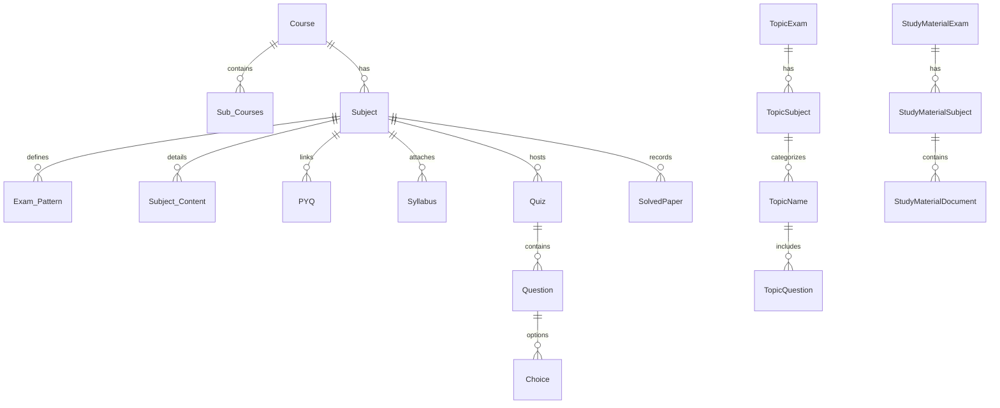

# 🎓 TRE Housing Publications - Full Stack EdTech Platform

[](https://react.dev/)
[](https://vitejs.dev/)
[](https://www.djangoproject.com/)
[](https://www.django-rest-framework.org/)
[](#license)

---

## 📌 Executive Overview

**TRE Housing Publications** is a modern, high-performance, full-stack educational web application designed for competitive exam preparation (such as BPSC TRE, Bihar STET, UPSC, SSC, and State PCS exams). 

The platform connects competitive exam aspirants with curated study materials, topic-wise practice MCQs, full-length test series, previous year solved question papers (PYQs), official syllabus breakdowns, and real-time job vacancy notifications.

---

## ✨ Key Features

### 🎓 Student Features
- **📚 Course & Syllabus Explorer:** Detailed breakdown of exam patterns, subjects, topic distribution, negative marking, and downloadable syllabus PDFs.
- **📄 PYQ & Solved Papers Vault:** Access categorized past question papers and official answer keys hosted on secure cloud storage (Google Drive / AWS S3).
- **⏱️ Full-Length Test Series:** Interactive mock exam environment with timed tests, auto-scoring, and immediate submission feedback.
- **🧠 Topic-Wise MCQ Practice Engine:** Hierarchy-based practice (Exam ➔ Subject ➔ Topic ➔ MCQs) with detailed answer explanations.
- **📖 Study Materials Library:** Organised 3-level document repository (Exam ➔ Subject ➔ PDFs) for rapid revision.
- **💼 Career & Exam Job Hub:** Filterable Job Vacancies dashboard (Government vs Private jobs) showing eligibility, fee, apply dates, and direct application links.
- **🔔 Live Job Notifications:** Real-time job vacancy notification listener with popup toast alerts for newly posted exams.
- **📊 Performance Dashboard:** Track test scores, completion metrics, and practice performance.
- **⚡ Ultra-Smooth UX:** Smooth inertia scrolling powered by Lenis, state caching via TanStack Query v5, and reactive micro-animations.

### 🛡️ Admin & Operational Capabilities
- **⚡ Automated Bulk JSON MCQ Upload:** Upload hundreds of questions and choices in seconds using formatted JSON arrays directly inside Django Admin.
- **🗂️ Multi-Tier Data Management:** Structured hierarchical data management for courses, sub-courses, topic quizzes, study material, and solved papers.
- **☁️ Cloud Link Storage:** Native support for external document links (AWS S3 / Google Drive) reducing server storage overhead.
- **📢 Push Update Management:** Instant publication of recent updates and job notification alerts.

---

## 🛠️ Technology Stack

### Frontend (React Ecosystem)
- **Core:** React 19, React Router DOM v7
- **Build Tool:** Vite 8
- **State & Data Fetching:** TanStack React Query v5 (5-minute stale-time caching)
- **HTTP Client:** Axios
- **Styling & UI:** Vanilla CSS, Bootstrap 5, Bootstrap Icons
- **Animation & FX:** Anime.js, Lenis (Smooth Scroll)
- **SEO & Metadata:** React Helmet Async
- **Notifications:** React Hot Toast

### Backend (Django Ecosystem)
- **Framework:** Django 3.2.25
- **API Engine:** Django REST Framework (DRF) 3.13.1
- **Database:** SQLite (Development) / PostgreSQL (Production via `psycopg2-binary` & `dj-database-url`)
- **Static Assets:** WhiteNoise 6.6.0
- **Image Processing:** Pillow 8.4.0
- **CORS Management:** Django CORS Headers 3.10.1
- **Deployment:** WSGI / Passenger WSGI supported

---

## 📁 Folder & Directory Structure

```
trehousingpublications-main/
│
├── README.md                      # Complete Project Documentation
├── Admin_Documentation.md         # Admin Panel Operations Guide
├── package.json                   # Root workspace scripts (build & dev)
│
├── TREBACKEND-main/               # Django REST API Backend Workspace
│   └── TREBACKEND-main/
│       └── trebackend/
│           ├── manage.py          # Django Management CLI
│           ├── req.txt            # Python Dependencies List
│           ├── requirements.txt   # Detailed Python Package Versions
│           ├── db.sqlite3         # SQLite Development Database
│           ├── create_admin.py    # Admin Creation Helper Script
│           ├── passenger_wsgi.py  # Production Server Entry Point
│           │
│           ├── trebackend/        # Core Django Project Configuration
│           │   ├── settings.py    # Apps, Database, Middleware, CORS Settings
│           │   ├── urls.py        # Main URL Dispatcher
│           │   └── wsgi.py        # WSGI Config
│           │
│           ├── core/              # Core Application Models & Views
│           │   ├── models.py      # Database Schema (Courses, Quizzes, Jobs, etc.)
│           │   ├── views.py       # DRF Views & JSON Response Logic
│           │   └── admin.py       # Django Admin Panel Customization
│           │
│           └── api/               # API Router Namespace
│               └── urls.py        # API Endpoints (v1, v2, jobs, quizzes)
│
└── trehousingpublications-main/   # React Frontend Workspace
    └── frontend-react/
        ├── package.json           # Frontend Dependencies & Build Scripts
        ├── vite.config.js         # Vite Configuration
        ├── index.html             # HTML Root Document
        ├── .env.example           # Frontend Environment Variables Template
        │
        └── src/
            ├── main.jsx           # App Bootstrap
            ├── App.jsx            # Routing, Lenis Scroll, QueryClient Setup
            ├── apiConfig.js       # Dynamic Base URL Config
            │
            ├── views/             # Page Views / Routes
            │   ├── HomePageView.jsx
            │   ├── SyllabusView.jsx
            │   ├── PYQPageView.jsx
            │   ├── SolvedPaperView.jsx
            │   ├── AnswerKeyPageView.jsx
            │   ├── TestSeriesView.jsx
            │   ├── TopicWiseMCQView.jsx
            │   ├── StudyMaterialView.jsx
            │   ├── JobVacancy.jsx
            │   └── ResultDashbord.jsx
            │
            └── components/        # Reusable UI Components
                ├── JobNotificationListener.jsx
                ├── Homepage/
                └── syllabus/
```

---

## 🗄️ Database Schema & Data Models

The backend model architecture is defined in `core/models.py`:



### Core Entities:
1. **Course & Sub_Courses:** Main categories (e.g., *BPSC TRE*) and versions (e.g., *TRE 1.0, 2.0, 3.0*).
2. **Subject & Exam_Pattern:** Subject details (*PGT, TGT, PRT*), maximum marks, question counts, duration, and PDF links.
3. **PYQ & Syllabus:** File references for past papers and official syllabus PDFs.
4. **Quiz, Question & Choice:** Full mock test engine with auto-parsing bulk JSON importer.
5. **TopicExam ➔ TopicSubject ➔ TopicName ➔ TopicQuestion:** 4-tier topic-wise practice engine with explanations.
6. **StudyMaterialExam ➔ StudyMaterialSubject ➔ StudyMaterialDocument:** 3-tier document repository.
7. **SolvedPaper:** Cloud-linked past papers and answer keys (S3 / Google Drive URL fields).
8. **JobVacancy & RecentUpdate:** Recruitment cards and ticker notifications for the Career Hub.

---

## 📡 REST API Documentation

Base URLs:
- **Development:** `http://127.0.0.1:8000/api/`
- **Production:** `https://backend.trehousingpublications.com/api/`

| Endpoint | Method | Description | Query Parameters |
|---|---|---|---|
| `/api/v1/` | `GET` | Fetch all courses & subjects | `course_id`, `subject_id`, `pdf=true`, `syllabus_list=true`, `syllabus={file}` |
| `/api/v2/` | `GET` | Fetch sub-courses & categorized PYQs | `course_id`, `sub_courses={id}`, `subject_id={id}`, `file={filename}` |
| `/api/v1/quiz/` | `GET` | Fetch mock tests with questions & options | `quiz_id={id}` |
| `/api/v1/topic-wise-mcq/` | `GET` | Fetch topic-wise exams, topics, & MCQs | `topic_id={id}`, `exam_id={id}` |
| `/api/v1/study-materials/` | `GET` | Fetch study material hierarchy & links | `exam_id={id}`, `subject_id={id}` |
| `/api/v1/solved-papers/` | `GET` | Fetch solved past papers & answer keys | `subject_id={id}` |
| `/api/job/` | `GET / POST` | List active job vacancies / Create job | `job_type=GOVT/PRIVATE`, `status=true` |
| `/api/job/<id>/` | `GET / PUT / DELETE` | Manage specific job vacancy | - |
| `/api/recent-updates/` | `GET` | Fetch recent updates ticker list | - |

---

## 📤 MCQ Bulk JSON Upload Guide

Admins can paste JSON arrays in the Django Admin panel under `Quiz.bulk_upload_json` or `TopicName.bulk_upload_json` to automatically create hundreds of questions instantly.

### Format 1: Full Option Array Structure
```json
[
  {
    "text": "What is the capital of India?",
    "choices": [
      { "text": "Mumbai", "is_correct": false },
      { "text": "New Delhi", "is_correct": true },
      { "text": "Kolkata", "is_correct": false },
      { "text": "Chennai", "is_correct": false }
    ]
  }
]
```

### Format 2: Flat Key Structure (Option A-D)
```json
[
  {
    "question": "Which gas is known as Laughing Gas?",
    "option_a": "Carbon Dioxide",
    "option_b": "Nitrous Oxide",
    "option_c": "Sulphur Dioxide",
    "option_d": "Methane",
    "correct_option": "B"
  }
]
```

---

## ⚙️ Environment Configuration

### Frontend Configuration (`frontend-react/.env`)
Create a `.env` file in `trehousingpublications-main/frontend-react/`:
```env
VITE_API_BASE_URL=https://backend.trehousingpublications.com
VITE_DEV_BACKEND_URL=http://127.0.0.1:8000
```

### Backend Configuration (`trebackend/.env`)
Create a `.env` file in `TREBACKEND-main/TREBACKEND-main/trebackend/`:
```env
DEBUG=True
SECRET_KEY=your-django-secret-key-here
ALLOWED_HOSTS=127.0.0.1,localhost,backend.trehousingpublications.com
DATABASE_URL=sqlite:///db.sqlite3
```

---

## 🚀 Local Development Setup

### Prerequisites
- **Node.js**: v18.0 or higher
- **Python**: v3.9 or higher
- **pip & venv**

---

### Step 1: Backend Setup (Django)

1. Open terminal and navigate to the backend directory:
   ```bash
   cd TREBACKEND-main/TREBACKEND-main/trebackend
   ```

2. Create and activate a Python virtual environment:
   - **Windows:**
     ```bash
     python -m venv venv
     venv\Scripts\activate
     ```
   - **macOS / Linux:**
     ```bash
     python -m venv venv
     source venv/bin/activate
     ```

3. Install required Python packages:
   ```bash
   pip install -r requirements.txt
   ```

4. Run Database Migrations:
   ```bash
   python manage.py makemigrations
   python manage.py migrate
   ```

5. Create Admin Superuser:
   ```bash
   python manage.py superuser
   # OR use the custom creation helper:
   python create_admin.py
   ```

6. Start the Django Development Server:
   ```bash
   python manage.py runserver
   ```
   The backend API will be available at `http://127.0.0.1:8000/`.  
   Django Admin access: `http://127.0.0.1:8000/admin/`.

---

### Step 2: Frontend Setup (React + Vite)

1. Open a new terminal and navigate to the frontend directory:
   ```bash
   cd trehousingpublications-main/frontend-react
   ```

2. Install Node.js dependencies:
   ```bash
   npm install
   ```

3. Start Vite Development Server:
   ```bash
   npm run dev
   ```
   The React app will be live at `http://localhost:5173/`.

---

## 🏗️ Production Build & Deployment

### Building Frontend
From the root workspace directory or `frontend-react` folder:
```bash
npm run build
```
This runs `vite build` and executes `copy-to-root.js` to bundle static assets ready for production serving.

### Collecting Backend Statics
```bash
python manage.py collectstatic --noinput
```
WhiteNoise is configured to serve static assets efficiently in production.

---

## 📄 License & Attribution

This software is developed for **TRE Housing Publications**.  
All rights reserved © 2026.